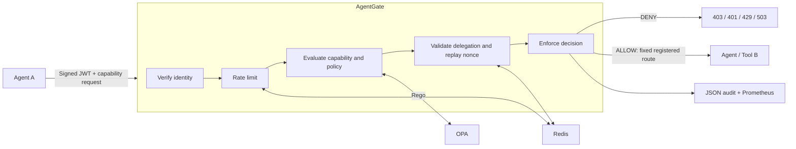

# Sollutions - AgentGate

**Zero-trust security gateway for AI agent-to-agent communication.**


<p align="center">
  
</p>


AgentGate is a security-first policy-enforcement layer built for autonomous AI agents, tools, and services.
Every protected interaction is authenticated, explicitly authorized, policy-evaluated and auditable.

AgentGate brings Zero-Trust authorization, capability-based access control and policy-as-code to agent-to-agent communication.
Unlike conventional API gateways, it makes agent identity, capability authorization, delegation control and security auditability first-class concepts.

> Never trust the agent. Verify identity, capability and policy for every interaction.

## Why AgentGate

An authenticated agent can still request an operation it should never perform.
A compromised planner should not inherit a finance agent's privileges just because both share a network.
AgentGate evaluates who is calling, which capability they need, which resource they intend to access, and whether current policy permits the interaction.
It also constrains delegation and makes authorization changes reviewable before deployment.

The included environment is a working local security lab with deterministic workloads, not an identity provider or a production deployment blueprint.

## Architecture



Python 3.12+, FastAPI, PyJWT/cryptography, OPA/Rego, Redis and HTTPX form the runtime.
The gateway holds only a public verification key. The development CLI holds the local demo signing key.
No LLM, external API or real financial transaction is involved.

## Security model

| Control | Purpose |
| --- | --- |
| JWT verification | Fixed RS256; signature, issuer, audience, expiry, identity and lifetime checks |
| Policy-as-code | Rego evaluates subject, capability, resource and server-verified environment |
| Deny by default | Unknown agents, capabilities, resources and missing rules are denied |
| Replay protection | Atomic Redis nonce consumption for sensitive actions and grant creation |
| Capability enforcement | Named permissions remain separate from identity and HTTP endpoints |
| Delegation | Explicit one-hop grants, recipient/resource binding, maximum five minutes |
| Rate limiting | Atomic per-identity Redis quota shared across workers and token rotations |
| Audit logging | Structured allow/deny and failure events without credentials or payloads |
| Registered proxy targets | Fixed URL, method and path; no caller-selected destinations or redirects |
| Fail closed | Policy/storage errors prevent protected operations |

**Authentication** establishes identity. **Authorization** decides permission.
A **capability** names an operation, a **resource** identifies its target, and a **policy** expresses the rules connecting them.

Sensitive operations require a fresh UUID `context.nonce`.
Nonces are scoped to identity and retained for at least the replay window and remaining token lifetime.
This is bounded replay resistance, not proof of possession or universal exactly-once execution.
See [security semantics](docs/SECURITY_DESIGN.md) for retry, persistence and delegation behavior.

## Quick start

Open this repository in a Linux GitHub Codespace with Python 3.12+, Docker and Docker Compose available.
All commands below run **inside the Codespace**; nothing is installed on your personal computer.
For a fresh Codespace terminal outside the checkout:

```bash
git clone https://github.com/SollutionsIT/agentgate.git
cd agentgate
make setup
make up
make demo
```

If your Codespace already opened this repository, start at `make setup`.
Setup installs a repository-local virtual environment, locked dependencies and a checksum-verified OPA binary.
It generates gitignored demo keys under `.local/keys/`; never reuse them outside this lab.
`make up` waits for all five services to become healthy. Only port 8080 is published, bound to loopback.

```text
travel-agent -> weather.read: ALLOW
travel-agent -> finance.transfer.request: DENY
```

Run CLI commands with `.venv/bin/agentgate`, or activate the environment first:

```bash
source .venv/bin/activate
agentgate status
agentgate token issue-demo --agent travel-agent
```

Keep any Codespaces port forwarding private. `make down` stops the stack while retaining replay state.
`make clean` stops the stack and deletes demo keys, Redis state and generated artifacts.

## Example

```bash
TOKEN="$(.venv/bin/agentgate token issue-demo --agent travel-agent)"
curl -sS http://127.0.0.1:8080/v1/authorize \
  -H "Authorization: Bearer $TOKEN" -H 'Content-Type: application/json' \
  -d '{"subject":{"agent_id":"travel-agent"},"action":"weather.read","resource":"weather-service"}'
```

The response includes `decision: allow`, a reason, policy ID, decision ID and UTC timestamp.
Changing the action to `finance.transfer.request` and resource to `finance-service` returns HTTP 403 with `capability_not_allowed`.

`POST /v1/proxy/weather` accepts the same body and forwards an allowed request to the registered weather workload.
Other registered targets are `balance` and `transfer-preview`; the latter never moves money.
Authorization-only decisions are advisory: they are not reusable tickets for bypassing the proxy's own checks.

| Endpoint | Purpose |
| --- | --- |
| `GET /health` | Process liveness |
| `GET /ready` | Redis availability and loaded OPA policy |
| `POST /v1/authorize` | Authenticate and evaluate a capability request |
| `POST /v1/proxy/{target}` | Enforce and forward through the target registry |
| `POST /v1/delegations` | Create an explicit, expiring delegation grant |
| `GET /metrics` | Prometheus counters and policy latency |

Health, readiness and metrics are unauthenticated operational endpoints for this loopback lab.
See [API examples](examples/README.md) for delegation and sensitive requests.

## Security lab

```bash
make attack-lab
# Machine-readable output:
.venv/bin/agentgate-redteam run --json
```

The lab makes bounded requests only to `127.0.0.1:8080`, resets demo identity quotas through local Compose, and verifies exact status/reason pairs.
It includes positive controls, credential failures, escalation, delegation, replay, rate limiting and proxy checks.
It does not scan hosts, accept remote targets or execute exploit payloads.

```text
[PASS] Unknown agent -> HTTP 403 (expected 403)
[PASS] Replayed operation -> HTTP 403 (expected 403)
[PASS] Registered weather proxy -> HTTP 200 (expected 200)
```

Run it only against the disposable demo stack; integration tests deliberately stop dependencies and exercise recovery.

## Policy regression

```bash
.venv/bin/agentgate policy test
.venv/bin/agentgate policy matrix
.venv/bin/agentgate policy matrix --json
.venv/bin/agentgate policy diff policies/agentgate.rego /path/to/candidate.rego --json
```

Policy tests execute real Rego and compare 60 agent/capability cases with a reviewed baseline.
Diff compares authorization and delegation across a finite set of identities, capabilities, resources and contexts.
New permissions produce `newly_allowed` entries and exit code 1; removals are reported separately.
Undefined or invalid policy outputs fail the comparison.
This detects tested privilege expansion; it is not a formal proof of policy equivalence.
Policy changes require review of both the rules and the baseline. Restart OPA after editing its bundle.

## Threat model

Read [THREAT_MODEL.md](docs/THREAT_MODEL.md), [SECURITY.md](SECURITY.md) and [deployment boundaries](docs/SECURITY_DESIGN.md).
AgentGate limits operations through protected interfaces. It does not make an agent trustworthy or prevent prompt injection inside an agent.
Stolen valid bearer tokens can still impersonate their owner within allowed scope; production needs a trusted issuer, TLS, infrastructure isolation and key lifecycle management.

## Development

```bash
make lint typecheck test policy-test
make up
make test-integration
make demo attack-lab
make package audit
make down
```

Tests cover fail-closed behavior, real dependency outages, concurrent Redis controls, delegation and audit redaction.
GitHub Actions runs checks on Python 3.12 and 3.14, policy tests, the Docker integration suite, package validation and dependency auditing.
CodeQL runs separately. Actions and container bases are pinned to verified immutable identifiers; Dependabot proposes updates.
See [CONTRIBUTING.md](CONTRIBUTING.md) for layout, environment requirements and review expectations.

## Roadmap

- Issuer/JWKS integration with bounded key rotation and revocation.
- Sender-constrained credentials for stronger stolen-token resistance.
- Signed policy bundles and controlled rollout with differential review.
- Durable external audit delivery with explicit retention guarantees.
- Production deployment profiles with authenticated infrastructure and workload isolation.

## License

[Apache License 2.0](LICENSE). Copyright 2026 Sollutions.
